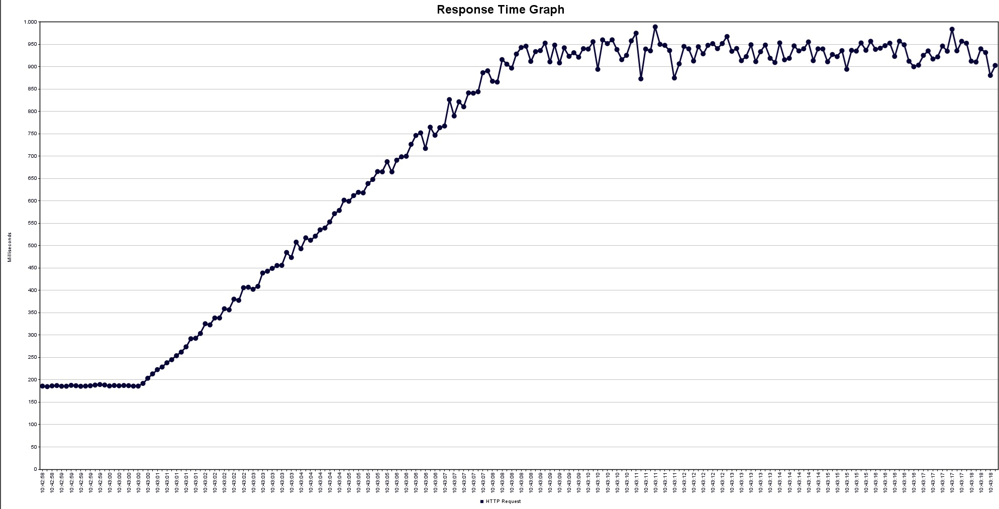
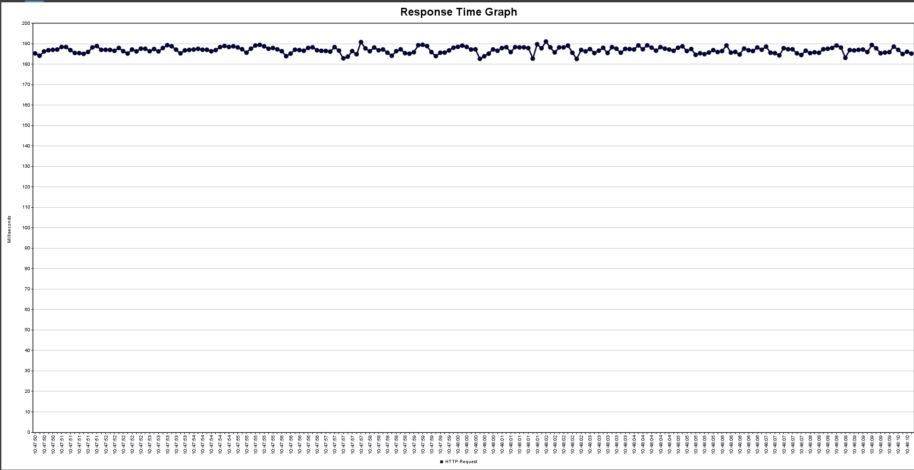
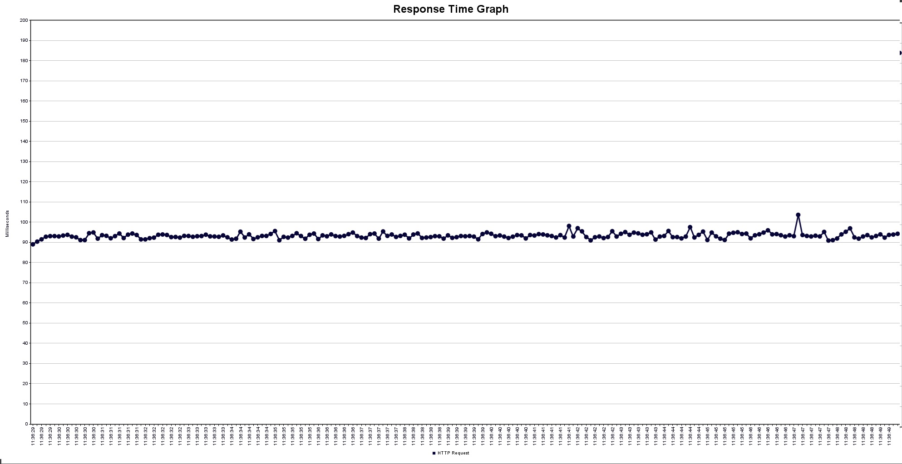
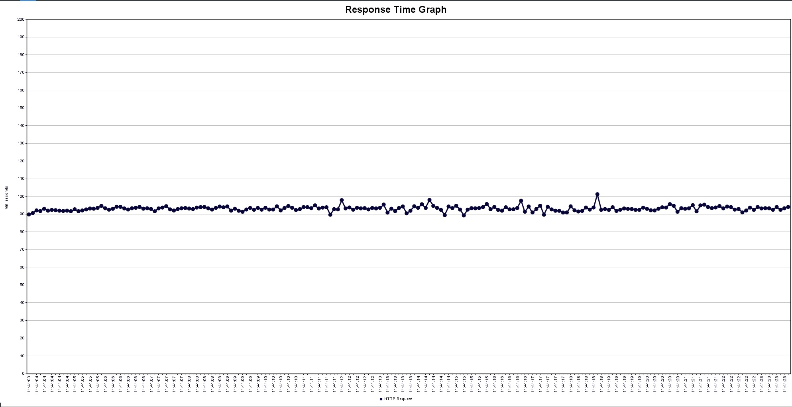

# StructuredTaskScope
Example how to use StructuredTaskScope
based on [this Repo](https://github.com/typed-rocks/structured-taskscopes/tree/main).

I have also added JMeter tests to show the performance gain compared to synchronous processing.

## Previous design: 
- Thread-per-Request => One Request is handled by its own thread. e.g. Java EE-Server

- One Thread costs 20MB and 1ms to launch. 

- Blocking => bad for I/O

## Virtual Thread: 
- about 1000 times cheaper
- no nead to write asynchronous code
- if virtualThreads are blocking, it gets detached from platform thread 
- Virtual Thread is in java heap memory
- after Blocking, it can attach to a second platform thread

## JMeter-Tests
I also used JMeter to do some manually Tests. I used 1000 users with ramp-up of 10 seconds and lifetime of 20 seconds.
I added a sample .jmx under src/main/resources/JMeter:
 
| Endpoint | VirtualThreads enabled | Average response time |
| :-------- | :------- | :------------------------- |
| `api/slow/infos/Test` | `false` |up to 900ms |
| `api/slow/infos/Test` | `true` | ~185ms |
| `api/fast/own-class/infos/test` | `true` | ~92ms | 
| `api/fast/java-class/infos/test` | `true` | ~92ms |

 
## Blocking-synchronous-approach:  
this is the response of GET ...api/slow/infos/Test, if you use blocking code and does not enable virtual-threads in your application.properties. 

As you can see, the response time gets slower, because all useable threads are waiting for I/O. 

## Virtual-Threads-synchronous-approach:
this is the response of GET ...api/slow/infos/Test, if you enable virtual-threads in your application.properties. 

As you can see, Java enables virtual threads just by adding the parameter. Therefore no OS-Threads get created for every request. 

## self-written-StructuredTaskScope-asynchronous-approach:
this is the response of GET ...api/fast/own-class/infos/test. Virtual Threads are enabled.

Calls to the FakeHttpService are asynchronous and non-blocking, so the execution-time is reduced. 

## java-StructuredTaskScope-asynchronous-approach:
this is the response of GET ...api/fast/java-class/infos/test. Virtual Threads are enabled.

Calls to the FakeHttpService are asynchronous and non-blocking, so the execution-time is reduced. 

